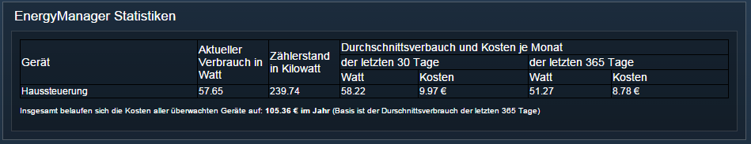
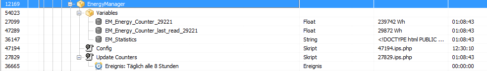

# ips-energymanager
IP-Symcon Addon zur Energie-Verbrauchsüberwachung und Dokumentation

[](https://github.com/florianprobst/ips-energymanager/releases/latest)
[](https://github.com/florianprobst/ips-energymanager/blob/master/LICENSE)

## Aufgabe des Skripts
Dieses Addon dient dazu, in [IP-Symcon](http://www.symcon.de) alle Geräte mit einer Stromüberwachung/-Erfassung in geeigneter Weise auszuwerten.
Dazu gehören Daten wie: 

* aktuelle Zählerstände
* aktueller Verbrauch
* kumulierter Verbrauch
* Verbrauch je Abrechnungsperiode
* Stromkosten je Abrechnungsperiode
* Stromkosten aktuell je Tag / Monat

# Unterstützte Hardware
Folgende Geräte werden derzeit unterstützt
## HomeMatic
* HM-ES-PMSw1-Pl - Funk-Schaltaktor 1-fach mit Leistungsmessung

## Weiterführende Informationen
Das Skript legt selbstständig benötigte IPS-Variablen und Variablenprofile unterhalb des Skriptes an.
Derzeit sind dies 2 Varibalen je Stromzähler, sowie eine globale Statistikvariable und 1 Variablenprofile. (Je nach IP-Symcon Lizenz bitte berücksichtigen)
Zur besseren Auffindbarkeit und eindeutigen Zuordnung werden alle Variablenprofile mit einem Präfix angelegt. 
Sofern in der Config nicht anderweitig angegeben lautet dieses standardmässig `EM_`.

## Installation

1. Dieses Repository im IP-Symcon Unterordner `webfront/user/` klonen. Bsp.: `C:\IP-Symcon\webfront\user\ips-energymanager` oder alternativ als zip-Datei herunterladen und in den `IP-Symcon/webfront/user` Unterordner entpacken.
2. In der IP-Symcon Verwaltungskonsole eine Kategorie `EnergyManager` und eine Unterkategorie `Variables` erstellen (Namen und Ablageorte sind frei wählbar)
3. Unterhalb der Kategorie `EnergyManager` sind mehrere Skripte manuell anzulegen. Diese sind u.a. die Konfiguration (IP des Routers, sowie das Passwort für den Zugang auf dessen Weboberfläche, als auch diverse Skripte zum Ausführen von Aktionen auf dem Router (Status update, Neustart, etc.). Die anzulegenden Skripte befinden sich im Unterordner `ips-scripts` und können per copy&paste in die IPS-Console eingetragen werden. Alternativ sind die Skripte auch weiter unten direkt beschrieben.

#### Struktur in der IP-Symcon Console nach Installation
(siehe dazu auch Screenshot unten)
* Speedport (Kategorie)
* - Variables (Kategorie)
* -- diverse automatisch generierte Statusvariablen nach erstem Statusupdate
* Config (script)
* Update Counters (script)

## IP-Symcon Console - anzulegende Skripte
###config script
Enthält die "globale" Konfiguration des EnergyManagers und wird von den anderen IPS-EnergyManager-Scripten aufgerufen.
Hier werden auch die Instanz-IDs aller zu überwachenden Stromzähler angegeben.

```php
<?
//Enthält die "globale" Konfiguration des EnergyManagers und wird von den anderen IPS-EnergyManager-Scripten aufgerufen.
//Hier werden auch die Instanz-IDs aller zu überwachenden Stromzähler angegeben.

require_once("../webfront/user/ips-energymanager/EnergyManager.class.php");

$parentId = 54023 /*[System\Skripte\EnergyManager\Variables]*/; //Ablageort für erstellte Variablen
$price_per_kwh = 0.2378; // Preis pro Kilowattstunde deines Stromanbieters
$debug = true;
$prefix = "EM_";
$archive_id = 18531 /*[Archiv]*/; //Instanz ID des IPS-Archivs in welchem die Werte des Stromzählers geloggt werden sollen.

//Ergänze alle IDs der zu überwachenden Stromzähler von Homematic (Typ HM_ES_PMSw1_PL) im nachfolgenden Array
$id_array_homematic_powermeters_HM_ES_PMSw1_PL = [
29221 /*[Hardware\Keller\Vorratskeller\QNAP\POWERMETER]*/
];


//ab hier nichts mehr ändern
$energymanager = new EnergyManager($parentId, $archive_id, $price_per_kwh, $prefix, $debug);

foreach($id_array_homematic_powermeters_HM_ES_PMSw1_PL as &$id){
	$energymanager->registerPowerMeter( new HomeMaticPowerMeterHM_ES_PMSw1_Pl($id) );
}
?>
```

###update counters script
Aktualisiert alle Stromzählerstände und berechnet die Stromkosten neu.
Die Speicherung der Werte erfolgt in den vom Skript angelegten Variablen.
Es empfiehlt sich dieses Skript durch ein IP-Symcon Event im Interval auszuführen.
(Bei mir läuft es beispielsweise alle 8 Stunden einmal).
```php
<?
//Aktualisiert alle Stromzählerstände und berechnet die Stromkosten neu.
$config_script = 47194 /*[System\Skripte\EnergyManager\Config]*/; //instanz id des ip-symcon config skripts

require_once(IPS_GetScript($config_script)['ScriptFile']);

$energymanager->update();
?>
```

##Notwendigkeit der Zählerstandvariablen
Die Zählerstände sind aus zwei Gründen separat in Skripteigenen Variablen gespeichert:
* Einheitliche Syntax: unabhängig vom Fabrikat werden immer die Zählerstände aller angebundenen Geräte in gleich lautenden Variablen und in dem gleichen Format / Einheit gespeichert.
* Wie im Fall des HomeMatic Zählers wird der Zählerstand des Gerätes bei einem Stromausfall auf 0 zurück gesetzt. Durch die separate Speicherung in eigenen Variablen kann das vermieden werden.

##Screenshots

